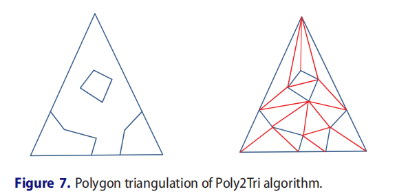

# Introduction

该分支主要用于两个三角网格三角形对求交后，依据生成的三角形的相交线段和相交顶点，重新进行三角化。如下图所示：

> From: Jiang X, Peng Q, Cheng X, et al. Efficient Booleans algorithms for  triangulated meshes of geometric modeling[J]. Computer-aided Design and  Applications, 2016, 13(4): 419-430.

tri2subtris：传入的点中不允许存在重复点（within epsilon）；使用顺序如下：

1. 构建顶点数组和受限边数组；
2. 利用顶点数组和受限边进行初始化；
3. 进行三角化；
4. 获取三角化结果；